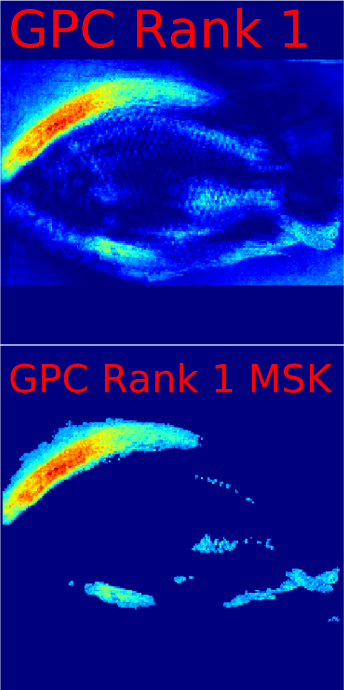
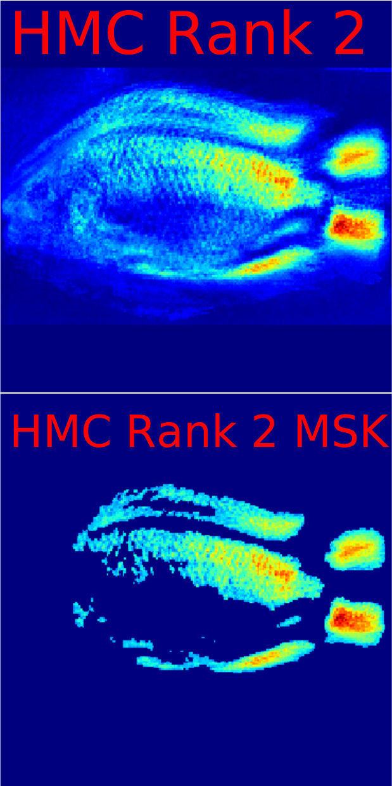
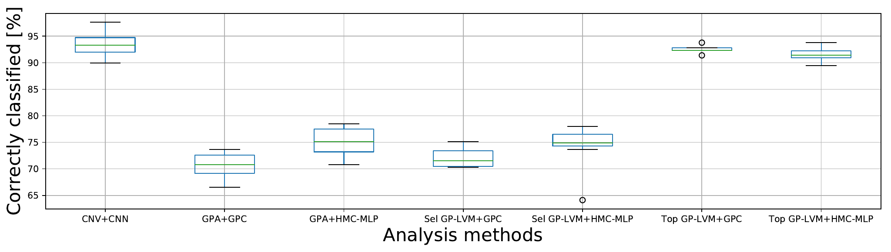
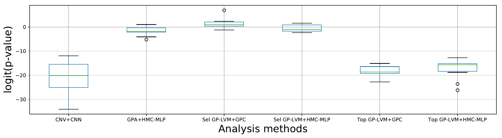

# NT_BodyParts
This repository is used for the PlosOne publication Assessing Ethiopian Nile tilapia physiognomy with machine learning by Wilfried Wöber, Manuel Curto, Papius Tibihika, Paul Meulenbroek, Esayas Alemayehu, Lars Mehnen, Harald Meimberg and Peter Sykacek

The data analysis is fully controlable with the run.bash script in the root directory.

Usage: bash run.sh [-I] [-i] [-G] [-g] [-P] [-C] [-c] [-N] [-n] [-R]"
   
    I... Install framework in VE
    
    i... Install R. Neals package
    
    G... Do GP-LVM
    
    g... Estimate GP-LVM features
    
    P... Do GPS (Procrustes) with R and Python
    
    C... Apply GPC to data
    
    c... Apply HMC to data
    
    N... Apply CNN classification
    
    n... Estimate CNN visualization
    
    R... Remove all installed and estimated files


# OS information and test settings
This package was tested unter Ubuntu 16.04 with a Python2 and 3 installations as well as CUDA 9.0 drivers. The main processing hardware was a NVIDIA 1080Ti and a Intel i9-7900X CPU. If you do not have the appropriate hardware/software, you may have to adapt the scripts to be fully functional on your system. Please see the **requirement files in the ''Python''** folder for used software versions.

**Note:** that the installation of the deep CNN libs may fail due to your hardware and driver settings.
**Note:** we use Python virtual environments in our scripts. You have to install the envitronments using the installation functionality of our run script in order to run all scripts.

Additionally, we used
* bash for script handling and basic data manipulation
* pdfjam and pdfcrop for pdf result handling
* cran R for GPS (you can use our Python implementation as well)

# Software handling
Initially, the libraries must be installed. This is currently implemented using Python virtual environments. The run.bash script autonomously installs all the relevant software packages by calling *bash run.sh -I -i*. 

**Note** that we currently assuma a Cuda 9.0 installation. If you do not have this driver, the software will use the default CPU Tensorflow/Keras implementation.

# Handling of this package
Before you start using this package note, that the all scripts may take a long time (>10h on our system) to finish. If you do not want to estimate the GP-LVM by yourself, you can initially copy the DUMMYBGPLVM_DATA.csv file into the GPLVM folder. Similaraly, our GPA analysis (DUMMYPROCRUSTES_DATA.csv) can be used. Both file can be found in the Data folder. Afterwards, you can do the remaining functionalities such as CNN, GPC, etc. 

Initially, you have to install all packages using the *-I* (for CNN and GPy) and *-i* flag (for HMC). 
Afterwards, the installation the GP-LVM must be applied using the *-G* flag. This is mandatory, since we use the GP-LVM result file for CNN data generation. **You cannot use the CNN/HMC before the BGPLVM_DATA.csv file was created at the end of the GP-LVM.** Finally, you can use the *-C* flag for GPC, the *-N* flag for CNN classification and *-c* flag for HMC. 
**If you want to do CNN or MHC based classification without GP-LVM, you can use our DUMMYBGPLVM_DATA.csv file in the data folder.*

For visualization, the *-g* flag for GP-LVM and *-n* flag for the CNN can be used. The heatmaps are stored in the model folders. To create the result vizualizations run the bash script in the Visualizations folder.

**Note:** all functions in the run script generates logfiles. The script output (CNN, GPC, etc.) are stored in those logfiles.
**Note:** You can remove **anything** (installation as well as estimated files) with the *-R* flag.

# Notes to the used models
Please read this information before you use our models.

**Note:** The analysis strongly relies on random initialization and probabilistic approaches. For example, the CNN weights are initialized randomly. Thus, the results will differ in each iteration.
**Note:** We store all results. This includes the CNN and HMC models. After running all models, ~77GB of data is generated.

## GP-LVM
The GPLVM folder contains of several scripts which calculates the latent representation, produce the heatmaps and the p-value images. The getGPLVM.py script implements the opmization of the latent representation. The base functionality of this procedure as well as main GPy data manipulation classes can be found in the Python folder. The FeatureVariance.py script implements the feature visualization. Finally, GPLVM_pval.py implements the p-value estimation and visualization.
## CNN
The CNN folder contains of two sub-folders. In the **Classification** folder, you will two scripts. CNN.py does the data handling and trainModel.py implements the CNN including GradCAM and LRP vizualization. In the **p-ValImage** folder, the run bash script and createVis.py script generates visualizations for the experiment. The createVis_Paper.py file do very similar stuff but generates additional images for the paper.
## GPC 
The GPy based GPC is run by the GPC.py script, which does the data pre- and post processing. The GPC uses our GPC base class, which can be found in the Python folder.
## HMC
The implementation of R. Neals HMC is implemented in several scripts, mainly used for data pre-processing and post processing. The results can be found in the resdata folder. All errors are reported to the logfile, which is generated for the installation as well as the classification.
## GPA
The GPA (Procrustes) are estimated using two scripts. You will find the script used in the publication (cran R script) as well as a Python script in the Procrustes folder. If you do not have a valid R instalaltion (including the shapes package), you can comment the line in the run script.
## Visualization
The visualization of our results (pie charts, rank heatmaps, classification accuracy, mutual information and McNemar tests) are automatically generated usign the run script in the Visualization folder. You have to run all models before the vizualization will work properly.

Following results were generated with this package: (The images were converted from pdf to png)

Rank images: 
| Rank 1| Rank 2   |
:-------------------------:|:-------------------------:
 | 
 | 

Model comparison:





# Usage of this software
You are free to use this software (see licence) or parts of this software. If you use parts of our package, please cite our paper.

```
@article{WoeberEtAl,
    author = {Wilfried W\"ober and Manuel Curto and Papius Tibihika and Paul Meulenbroek and Esayas Alemayehu and Lars Mehnen and Harald Meimberg and Peter Sykacek},
    journal = {PLOS ONE},
    title = {Assessing Ethiopian Nile Tilapia Physiognomy with Machine Learning},
    year = {2021},
    month = {},
    volume = {},
    pages = {},
    
```
